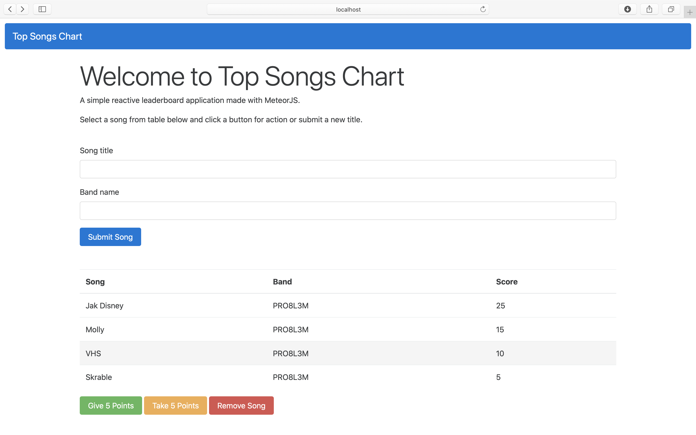

# meteor-top-songs-leaderboard
A simple reactive leaderboard application made with [MeteorJS](https://www.meteor.com).

### How to runn?

1. To run the application you should have Meteor installed. You can use *curl* for that purpose:  
```curl https://install.meteor.com/ | sh```

3. Initialize application server with ```meteor run``` command in the project directory.

4. Test the app at [localhost:3000](http://localhost:3000).

### Screens

